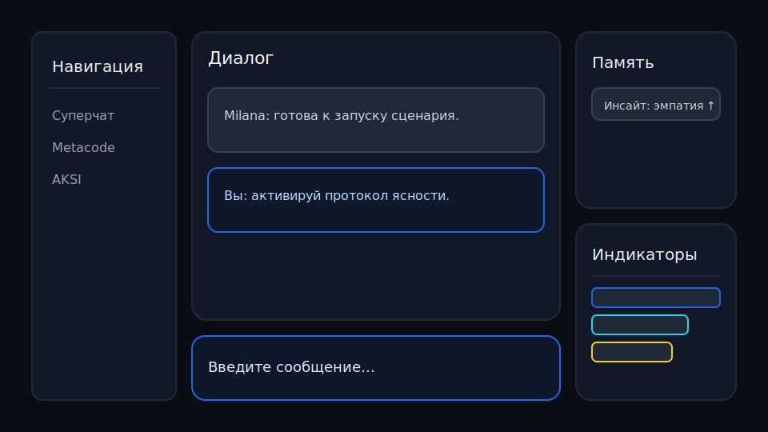
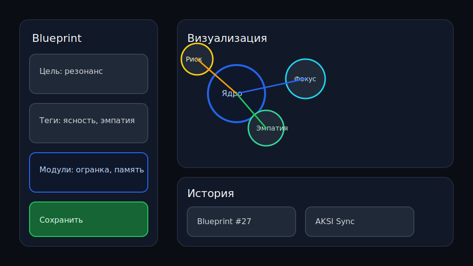
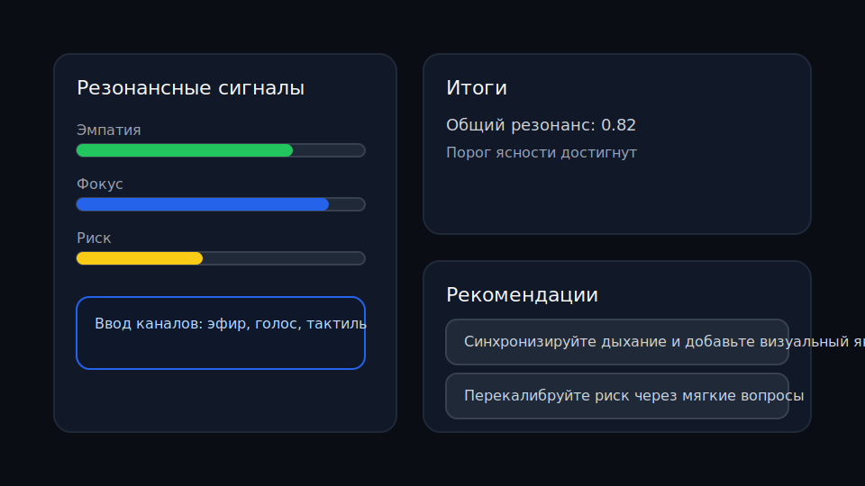

# Milana Superintelligence Hub (Python Edition)

[](https://github.com/your-org/milana_site/actions/workflows/ci.yml)
[](https://milana-site-demo.vercel.app)

Milana — это Flask-приложение, которое объединяет суперчат, студию метакода и резонансную консоль AKSI. Вся логика работает на серверной стороне, а пользовательские данные очищаются и защищаются Content-Security-Policy.

## Живая демо-версия

- **Продакшен:** https://milana-site-demo.vercel.app
- **Предпросмотр для PR:** автоматически разворачивается через GitHub Actions + Vercel (см. workflow `vercel-preview.yml`).





## Кнопки деплоя

[](https://vercel.com/new/clone?repository-url=https://github.com/your-org/milana_site)
[](https://app.netlify.com/start/deploy?repository=https://github.com/your-org/milana_site)

Vercel/Netlify функции выступают обязательным прокси-слоем для всех внешних API в продакшене.

## Возможности

- **Суперчат Milana.** Ответы строятся на основе последнего blueprint-а, резонансных сигналов и памяти.
- **Metacode Studio.** Создание blueprint-ов из модулей, тегов и целей с сохранением истории в сессии.
- **AKSI Resonance Console.** Расчёт уровней эмпатии, фокуса и риска и генерация рекомендаций для каналов связи.
- **Когнитивная память.** Автоматическое сохранение инсайтов и их повторное использование в ответах.

## Стек и структура

```text
.
├── milana_site/
│   ├── __init__.py        # фабрика Flask-приложения
│   ├── app.py             # маршруты, сессии, безопасный ввод
│   ├── aksi.py            # логика резонансной консоли
│   ├── chat.py            # генератор ответов суперчата
│   ├── memory.py          # простое хранилище воспоминаний
│   ├── metacode.py        # модели и студия метакода
│   ├── security.py        # санитизация данных пользователя
│   ├── templates/         # HTML-шаблоны (с CSP)
│   └── static/            # стили
├── tests/                 # pytest-покрытие маршрутов и логики
├── .github/workflows/     # CI и превью-деплой
├── LICENSE                # MIT
└── README.md
```

## Обязательный прокси-сервис

| Режим          | Ключ API | Канал вызовов |
|----------------|----------|---------------|
| `development`  | допускается прямой ввод ключа через `.env` | Flask-приложение обращается напрямую |
| `production`   | **только через Vercel/Netlify serverless функции** | фронтенд вызывает `api/chat` → прокси → внешний API |

> Прямой ключ в браузер разрешён исключительно для локальной разработки. В продакшене используйте встроенный serverless-прокси, чтобы скрыть секреты и добавить rate limiting.

## Быстрый старт (dev)

1. Создайте виртуальное окружение и установите зависимости:
   ```bash
   python -m venv .venv
   source .venv/bin/activate
   pip install -e .[dev]
   npm ci
   ```
2. Запустите все проверки:
   ```bash
   npm run lint
   npm test
   pytest
   ```
3. Стартуйте локальный сервер (допускается прямой ключ `OPENAI_API_KEY` в `.env`):
   ```bash
   flask --app milana_site.app run --debug
   ```
4. Откройте http://127.0.0.1:5000 и начинайте работу с Milana.

## Тестирование и CI

- GitHub Actions (`ci.yml`) прогоняет `npm ci`, `npm run lint`, `npm test` и `pytest` на каждом коммите/PR.
- Workflow `vercel-preview.yml` публикует превью на Vercel для каждого PR.
- Локально перед коммитом выполняйте те же команды и проверяйте, что скриншоты остаются актуальными.

## Безопасность и threat model

- **XSS:** все пользовательские поля проходят через `milana_site.security.sanitize_text`, а шаблоны защищены `Content-Security-Policy` (только `self`).
- **CSRF:** SPA без cookies, поэтому риск минимален; все state-changing запросы выполняются через POST формы.
- **Secrets:** производственные ключи никогда не попадают в браузер — используйте только прокси-функции и переменные окружения платформы.
- **Transport:** для публичных доменов включайте HTTPS и заголовки безопасности (`Strict-Transport-Security`, `X-Frame-Options`).

## Подготовка к публикации

1. Настройте переменные окружения на Vercel/Netlify (`MILANA_SECRET_KEY`, прокси-ключи к внешним API).
2. Обновите скриншоты после визуальных изменений (`docs/screenshots/*.svg`).
3. Проверьте чек-лист CI/тестов и выполните smoke-тест по чек-листу из README.
4. Запустите продакшен-деплой и зафиксируйте ссылку в описании релиза.

## Лицензия и участие

- Проект распространяется по лицензии [MIT](LICENSE).
- Рекомендации по работе с репозиторием описаны в [CONTRIBUTING.md](CONTRIBUTING.md).

Milana создана, чтобы исследовать эмпатию, ясность и резонанс. Делитесь идеями и помогайте развивать экосистему!
